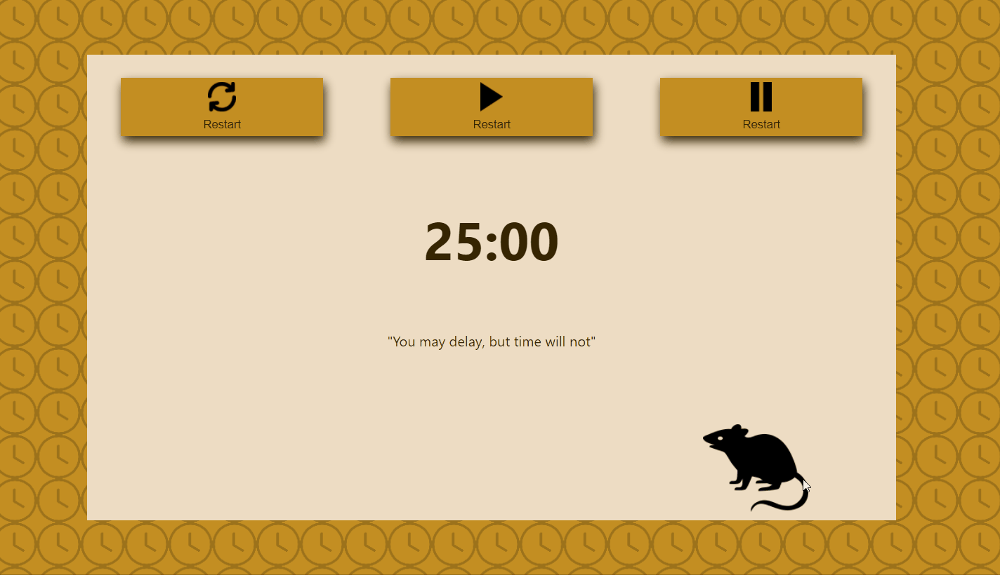
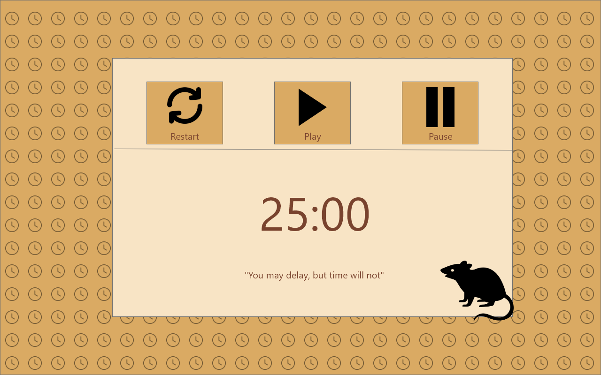

# Pomodoroo Timer built with React

### The challenge

- Build out a pomodoro timer with constantly changing time quotes.

### Initial Wireframe

### Links

- [Click to play with the app](https://jcsmileyjr.github.io/smiley-pomodoro-timer/)
- [Blog post Coming soon!!!](https://dev.to/jcsmileyjr/frontend-challenge-12-time-tracking-dashboard-jdc)

### Built with

- React

## Author

- Website - [JC Smiley](https://www.jcsmileyjr.com)
- Frontend Mentor - [@jcsmileyjr](https://www.frontendmentor.io/profile/jcsmileyjr)
- Twitter - [@JCSmiley4](https://twitter.com/JCSmiley4)
